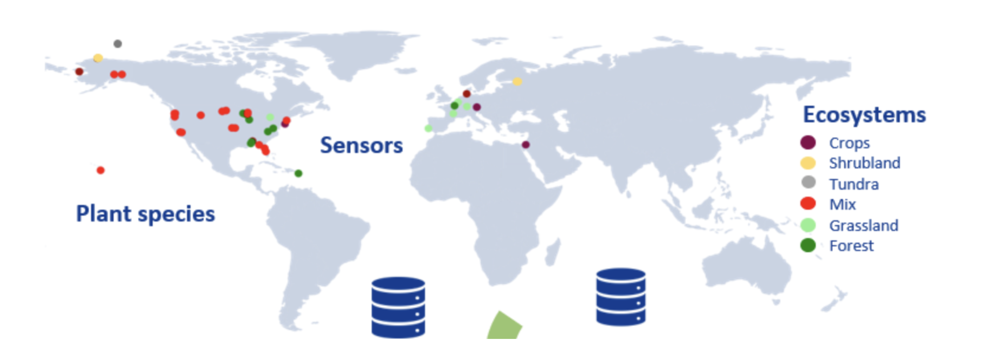

<!-- The banner to your repo -->

  

<h1 align="center">Hyperspectral Soft Sensor 🌈📊</h1>

<b>Comparing multivariate regression techniques for hyperspectral plant trait prediction</b>

---

## 🚀 Introduction
The project **Spectral Soft Sensor Project (LUT, 2025)** is focused on **Theme A3 (Advanced, 30p)**. The dataset combines **hyperspectral measurements (450–2500 nm, 1 nm resolution)** with plant functional traits such as **leaf pigments, equivalent water thickness, and leaf area index**.  
Our task is to **predict vegetation traits** from spectra using multiple regression approaches and evaluate their **strengths and weaknesses** across **accuracy, interpretability, and computation time**. We compare:
- **MLR** (Multiple Linear Regression)
- **PCR** (Principal Component Regression)
- **PLS** (Partial Least Squares)
- **k-PLS** (Kernel Partial Least Squares)

📄 For full details, see the official [Theme A3 project description (PDF)](docs/ADAML23%20-%20Spectral%20Soft%20Sensor%20Project%20Work.pdf).

---

## 👥 Team
- Nada Rahali  
- Umme Tanjuma Haque  
- Chamath Wijerathne

---

## 📌 Project Overview
- **Dataset origin**: Multi-sensor vegetation study spanning different continents, climates, and vegetation types.  
- **Inputs (X)**: Hyperspectral reflectance (450–2500 nm), preprocessed to:
  - remove water absorption bands: **1351–1430**, **1801–2023**, **2451–2501**
  - apply **Savitzky–Golay** smoothing
  - **interpolate** bands to a uniform 1 nm grid
- **Responses (Y)**: Leaf and canopy traits (e.g., pigments, leaf area index, equivalent water thickness).
- **Goal**: Predict traits using **MLR/PCR/PLS/k-PLS**, then compare methods by:
  1) test-partition performance,
  2) model interpretability,
  3) training & inference time.

---

## 🗂️ Dataset Description  

The dataset originates from a **multi-sensor study**, where spectral data and vegetation properties from **42 datasets** collected across various continents, climates, and vegetation types have been combined.  

- **Hyperspectral data (input variables):**  
  - Wavelengths: **450–2500 nm**, in 1 nm increments  
  - Preprocessing steps:  
    1. Removal of water absorption bands (**1351–1430**, **1801–2023**, **2451–2501**)  
    2. Smoothing with **Savitzky–Golay filter**  
    3. Band interpolation to ensure the same resolution  

- **Leaf and canopy traits (response variables):**  
  - Leaf pigments  
  - Leaf Area Index (LAI)  
  - Equivalent water thickness  
  - Other canopy structural and physiological traits (see table in dataset description)  

---

## 🛠️ Methods & Stack
- **Language**: Python  
- **Core libs**: NumPy, pandas, matplotlib, scikit-learn  
- **Analysis**: EDA, PCA, model calibration/validation  
- **Modeling**: MLR · PCR · PLS · k-PLS  
- **Evaluation**: Hold-out / CV performance (RMSE/R²/MAE), timing, and interpretability notes

---

## 📅 Milestones (per course brief)
- **Week 1 (W36)**: Team formation & topic selection  
- **Week 2 (W37)**: Data summary & visualization (PDF #1 + code)  
- **Week 3–4 (W38–W39)**: Pretreatment & modeling plan (PDF #2 + code)  
- **Week 5–6 (W40–W41)**: Initial model results (PDF #3 + code)  
- **Week 7–8 (W42–W43)**: Final models & report (PDF #4 + code)

---

## 📑 Deliverables
- Weekly PDFs + corresponding code notebooks/scripts  
- Reproducible pipeline for EDA → pretreatment → modeling → evaluation  
- Final consolidated PDF + comparison tables/plots

---

## 🎯 Learning Objectives
- Turn **hyperspectral reflectance** into **trait-level insights**  
- Benchmark **MLR/PCR/PLS/k-PLS** for trait prediction  
- Balance **accuracy, interpretability,** and **computational efficiency**  
- Practice collaborative workflow with Teams/WhatsApp + GitHub

---

## 📂 Repository Structure (planned)
- To be added later on. 

